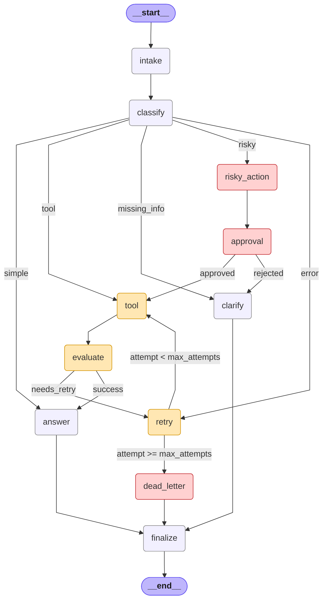

# Graph Diagram (bonus extension)

Generated by `scripts/bonus_diagram.py`.

## Why this is not the raw `draw_mermaid()` output

LangGraph's `CompiledStateGraph.get_graph().draw_mermaid()` only renders
conditional edges when each `add_conditional_edges()` call is given an
explicit `path_map`. Our routing functions return destination names
directly (cleaner code, but the auto-drawer collapses them to
`classify --> __end__`). This script reconstructs the full topology
from the routing truth tables in `src/langgraph_agent_lab/routing.py`
so reviewers can verify every branch — including the bounded retry
loop and the HITL approval gate.

## Runtime node set (from compiled graph)

`__end__`, `__start__`, `answer`, `approval`, `clarify`, `classify`, `dead_letter`, `evaluate`, `finalize`, `intake`, `retry`, `risky_action`, `tool`

## Full diagram

## Legend

- Yellow nodes form the bounded retry loop (`tool → evaluate → retry → tool`).
- Red nodes are the human-in-the-loop and dead-letter gates.
- Edge labels on conditional arrows show the exact predicate from `routing.py`.
