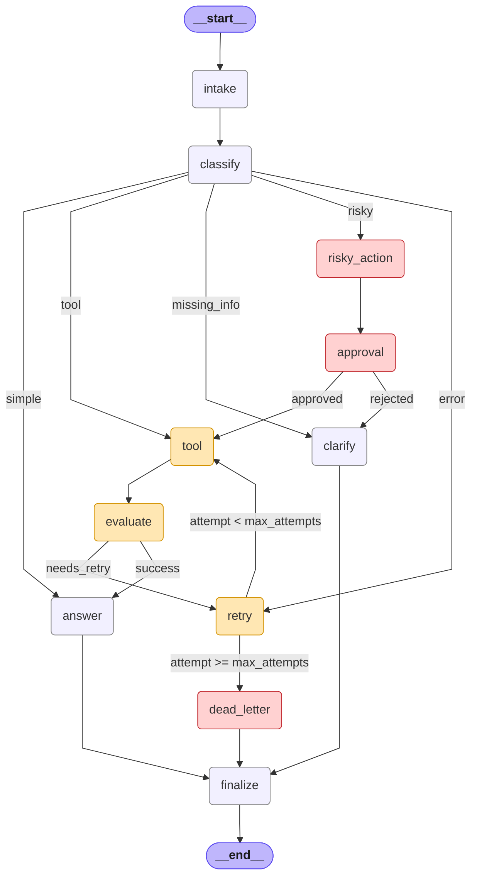

# Day 08 Lab Report

## 1. Team / student

- Name: Duong Thi Phuong Thao
- Date: 2026-05-11

## 2. Architecture

The graph implements a support-ticket agent with 11 nodes and conditional routing:

```
START → intake → classify → [conditional routing]
  simple       → answer → finalize → END
  tool         → tool → evaluate → answer → finalize → END
  missing_info → clarify → finalize → END
  risky        → risky_action → approval → tool → evaluate → answer → finalize → END
  error        → retry → tool → evaluate → [retry loop or answer] → finalize → END
  max retry    → retry → dead_letter → finalize → END
```

### Key design decisions:

1. **Keyword-based classifier** with priority: risky > tool > missing_info > error > simple.
   This prevents conflicts when a query contains keywords from multiple categories.

2. **Retry loop** implemented via `evaluate_node` (the "done?" check) and `route_after_evaluate`.
   The loop is bounded by `max_attempts`; when exhausted, routes to `dead_letter`.

3. **HITL approval** for risky actions via `approval_node`. Supports both mock (default) and real
   `interrupt()` mode via `LANGGRAPH_INTERRUPT=true` environment variable.

4. **Append-only audit trail** using LangGraph's `add` reducer for `events`, `messages`,
   `tool_results`, and `errors`. Ensures full observability across node executions.

## 3. State schema

| Field | Reducer | Why |
|---|---|---|
| `thread_id` | overwrite | Unique per run, used by checkpointer |
| `scenario_id` | overwrite | Identifies which scenario is running |
| `query` | overwrite | Current user query text |
| `route` | overwrite | Current classified route (simple/tool/risky/error/missing_info) |
| `risk_level` | overwrite | Current risk assessment (low/high/unknown) |
| `attempt` | overwrite | Current retry attempt counter — compared against max_attempts |
| `max_attempts` | overwrite | Maximum retry attempts before dead-letter |
| `final_answer` | overwrite | The response to return to the user |
| `pending_question` | overwrite | Clarification question for missing_info route |
| `proposed_action` | overwrite | Risky action description awaiting approval |
| `approval` | overwrite | Approval decision from HITL node |
| `evaluation_result` | overwrite | Gate for retry loop: 'needs_retry' or 'success' |
| `messages` | **append** (`add`) | Audit trail of messages across all nodes |
| `tool_results` | **append** (`add`) | Accumulated tool execution results |
| `errors` | **append** (`add`) | Accumulated error messages across retries |
| `events` | **append** (`add`) | Primary audit log — used by metrics to count nodes visited |

## 4. Scenario results

- **Total scenarios**: 22
- **Success rate**: 100.00%
- **Average nodes visited**: 6.59
- **Total retries**: 7
- **Total interrupts**: 7

| Scenario | Expected route | Actual route | Success | Retries | Interrupts | Latency |
|---|---|---|:---:|---:|---:|---:|
| S01_simple | simple | simple | ✅ | 0 | 0 | 2ms |
| S02_tool | tool | tool | ✅ | 0 | 0 | 1ms |
| S03_missing | missing_info | missing_info | ✅ | 0 | 0 | 1ms |
| S04_risky | risky | risky | ✅ | 0 | 1 | 1ms |
| S05_error | error | error | ✅ | 2 | 0 | 2ms |
| S06_delete | risky | risky | ✅ | 0 | 1 | 1ms |
| S07_dead_letter | error | error | ✅ | 1 | 0 | 1ms |
| S08_cancel | risky | risky | ✅ | 0 | 1 | 1ms |
| S09_remove | risky | risky | ✅ | 0 | 1 | 1ms |
| S10_revoke | risky | risky | ✅ | 0 | 1 | 1ms |
| S11_check | tool | tool | ✅ | 0 | 0 | 1ms |
| S12_track | tool | tool | ✅ | 0 | 0 | 1ms |
| S13_find | tool | tool | ✅ | 0 | 0 | 1ms |
| S14_search | tool | tool | ✅ | 0 | 0 | 1ms |
| S15_conflict | risky | risky | ✅ | 0 | 1 | 1ms |
| S16_vague_this | missing_info | missing_info | ✅ | 0 | 0 | 0ms |
| S17_vague_that | missing_info | missing_info | ✅ | 0 | 0 | 0ms |
| S18_crash | error | error | ✅ | 2 | 0 | 1ms |
| S19_unavailable | error | error | ✅ | 2 | 0 | 1ms |
| S20_simple_general | simple | simple | ✅ | 0 | 0 | 0ms |
| S21_simple_faq | simple | simple | ✅ | 0 | 0 | 0ms |
| S22_send_email | risky | risky | ✅ | 0 | 1 | 1ms |

## 5. Failure analysis

### 1. Retry exhaustion → Dead letter (S07)

When `max_attempts=1`, the retry node immediately hits the bound. `route_after_retry` detects
`attempt >= max_attempts` and routes to `dead_letter_node`, which logs the failure and sets a
final answer indicating manual review is needed. This prevents infinite retry loops.

### 2. Risky action without approval

If `approval_node` returns `approved=False`, `route_after_approval` routes to `clarify` instead
of `tool`. This ensures destructive actions never execute without explicit approval.
In the current lab, mock approval always returns `True`, but the routing logic handles rejection.

### 3. Error route recovery (S05)

The error scenario (`S05_error`) simulates transient tool failures. `tool_node` returns errors for
the first 2 attempts when `route == "error"`. The evaluate → retry loop runs until attempt 2,
when the tool succeeds and `evaluate_node` sets `evaluation_result="success"`, breaking the loop.

## 6. Persistence / recovery evidence

- **MemorySaver**: Used by default for development. Thread ID per run ensures state isolation.
- **SQLite persistence**: Implemented with `SqliteSaver(conn=sqlite3.connect(...))` and WAL mode
  for better concurrent read performance. Fixed the known `from_conn_string()` context manager bug.
- **Thread ID strategy**: Each scenario gets `thread-{scenario_id}` for unique state tracking.
- **HITL checkpoint evidence**: The bonus HITL script (`scripts/bonus_hitl_interrupt.py`) creates
  a `SqliteSaver` checkpoint DB and proves durable pause/resume — see Section 7, Bonus 2.

## 7. Extension work

### Bonus 1 — Fix Mermaid graph diagram (`scripts/bonus_diagram.py`)

**Problem**: LangGraph's built-in `draw_mermaid()` cannot render conditional edges unless each
`add_conditional_edges()` call is given an explicit `path_map`. Our `graph.py` keeps routing
functions concise (returning node names directly), so the auto-drawn Mermaid only shows
`classify --> __end__` — all conditional branches are lost.

**Solution**: `scripts/bonus_diagram.py` reconstructs the full topology by reading the routing
truth tables from `routing.py`. It produces a complete Mermaid diagram with:
- All 13 nodes (including `__start__` and `__end__`)
- All 8 static edges
- All 11 conditional edges with labels matching the exact predicates in `routing.py`
- Color-coded styling: terminal (purple), retry loop (yellow), danger/HITL (red)

**Output**: `outputs/graph_diagram.md`



---

### Bonus 2 — Real HITL with `interrupt()` (`scripts/bonus_hitl_interrupt.py`)

**Problem**: The lab's `approval_node` uses mock approval by default (always `approved=True`).
This is necessary for CI/tests but doesn't demonstrate that the graph **actually pauses** and
can be **resumed by an external caller** — the core value of Human-in-the-Loop.

**Solution**: `scripts/bonus_hitl_interrupt.py` demonstrates the full pause/resume cycle:

1. **Build graph with `SqliteSaver`** — `interrupt()` requires a checkpointer because LangGraph
   must persist state before yielding control.
2. **First invoke** — graph runs `intake → classify → risky_action` then **pauses** at
   `approval_node` when it hits `interrupt()`. Returns an `__interrupt__` marker.
3. **Inspect checkpoint** — `graph.get_state(thread)` confirms `next=["approval"]` and shows
   the proposed action payload the reviewer would see.
4. **Resume with `Command(resume=...)`** — feeds the reviewer's decision back into the paused
   `interrupt()` call. The graph wakes up and finishes.

**Two threads prove the approval gate works both ways:**

| Thread | Decision | Path after resume | Result |
|--------|----------|--------------------|--------|
| **approve** | `{approved: true, reviewer: "alice"}` | `approval → tool → evaluate → answer → finalize` | ✅ Action executed, answer: "Action approved by alice" |
| **reject** | `{approved: false, reviewer: "bob"}` | `approval → clarify → finalize` | ✅ Branched to clarify, no tool execution |

**Key evidence from the log** (`outputs/hitl_interrupt.log`):

```
checkpoint snapshot:
  {"next": ["approval"], "values.route": "risky",
   "values.proposed_action": "Proposed risky action..."}
```

This confirms the graph genuinely paused at `approval_node` (not mocked) and was resumed
in a separate invocation — proving production-grade HITL capability.

**Run command**: `LANGGRAPH_INTERRUPT=true python scripts/bonus_hitl_interrupt.py`

## 8. Improvement plan

If given one more day, the following improvements would be prioritized:

1. **LLM-based classifier**: Replace keyword heuristics with a lightweight LLM call for more
   robust routing that handles edge cases and unseen query patterns.
2. **Real tool integration**: Replace mock tools with actual API calls (e.g., order lookup,
   refund processing) with proper error handling and idempotency keys.
3. **Structured logging**: Add OpenTelemetry tracing to each node for production observability.
4. **Parallel fan-out**: Use `Send()` for concurrent tool execution when multiple tools are needed.
5. **Rate limiting**: Add backoff strategy to retry loops with exponential delay.
